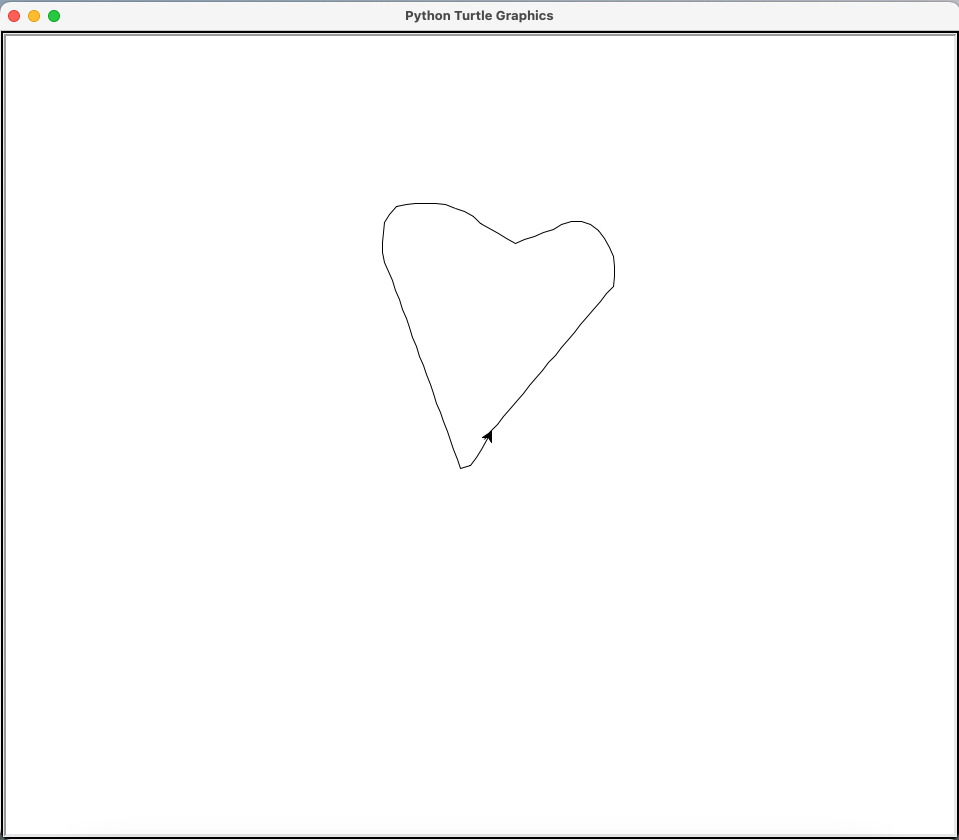

# etch-a-sketch
An Etch a Sketch App using Python Turtle

## Overview

Play Etch a Sketch using this Python App. Commands to use:
- W = forwards
- S = Backwards
- A = Counter-Clockwise
- D = Clockwise
- C = Clear




## To download

```
git clone https://github.com/menonrudhra/etch-a-sketch.git
cd etch-a-sketch
```

## To run the App 

```
python3 main.py
```

